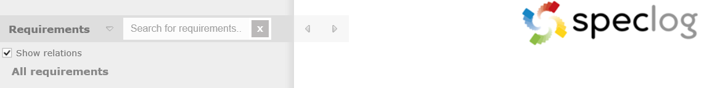
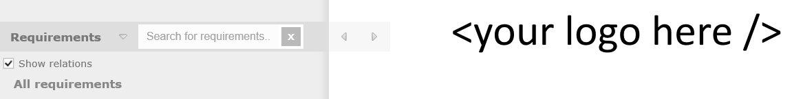

[SpecLog](http://www.speclog.net) can export workspaces in HTML format. The default export templace contains a SpecLog logo:

SpecLog Logo Replacer enables you to have your own logo in the exported file:

SpecLog Logo Replacer is licensed under a [BSD license](LICENSE.md).

Provided by .

*Neither AIM Software GmbH nor SpecLogLogoReplacer are endorsed by or affiliated with SpecLog, SpecFlow or TechTalk in any way.*